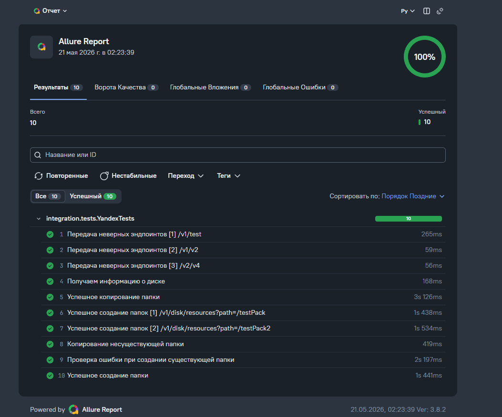

## Реализованные тесты

### Positive tests
- Получение информации о диске
- Создание папки
- Копирование папки
- Создание нескольких папок

### Negative tests
- Создание дубликата папки
- Копирование несуществующей папки
- Проверка невалидных endpoint

---

## Запуск тестов

```bash
mvn clean test
```

---

## Генерация Allure отчета

```bash
allure serve target/allure-results
```

---

## Environment Variables

Для запуска необходимо указать токен
